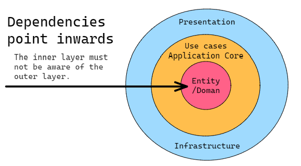
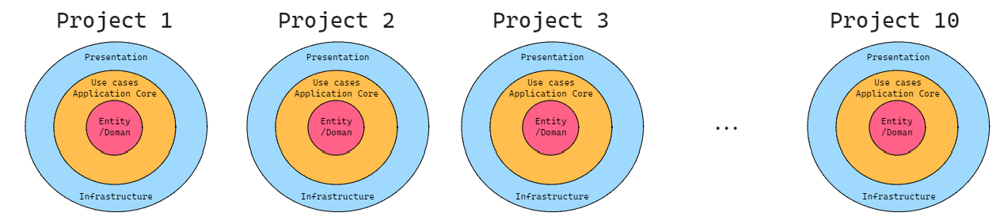
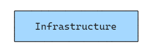
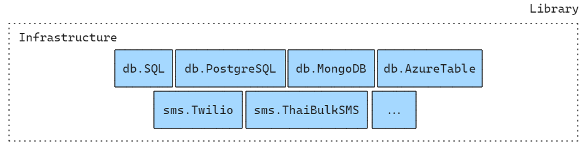
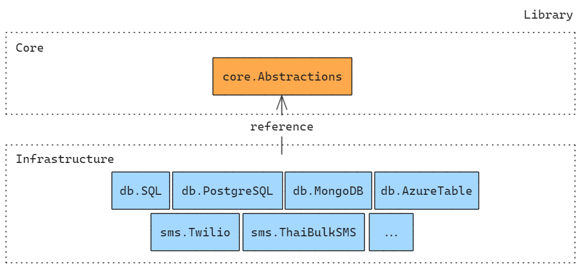
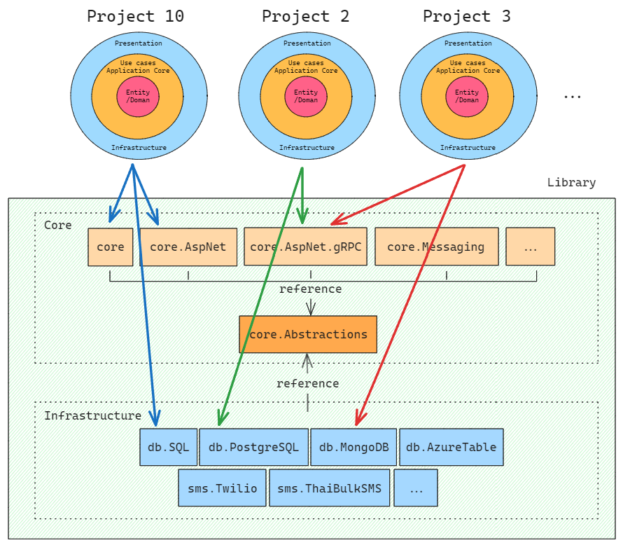
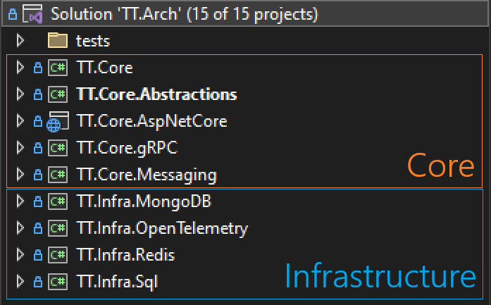

# Architecture design
Main nuget packages used in TTSS and public

## พื้นฐาน
หลักในการออกแบบโครงสร้างนี้ถูกเริ่มมาจาก `Clean Architecture` โดยมีหัวใจสำคัญคือการแบ่งหน้าที่รับผิดชอบออกเป็นส่วนๆแยกขาดออกจากกัน โดยแบ่งออกเป็นกลุ่มได้ดังนี้
1. `Domain` - ดูแลของที่เกี่ยวกับ **ภาพรวมทั้งหมดของระบบ (Enterprise wide)** โดยให้มองว่าของที่อยู่ในกลุ่มนี้เป็นเหมือน **กฎ** ที่บอกว่าระบบนี้ต้องมีอะไรบ้าง, กฎของเรื่องนั้นๆต้องเป็นยังไง **แต่จะไม่ได้ลงรายละเอียดว่าจะทำด้วยวิธีการไหน** เพื่อเปิดให้สามารถเปลี่ยนแปลงวิธีการได้โดยที่ยังคงรักษากฏเหล่านั้นอยู่ เช่น ข้อมูลพนักงานจะต้องมีอะไรบ้าง, การลงเวลาทำงานของพนักงานต้องมีรายละเอียดอะไร ฯลฯ ซึ่งโดยส่วนใหญ่ของในกลุ่มนี้จะเป็น Models, Rules, Data structure, Internal exceptions หรือพูดง่ายๆคือของกลางที่จะถูกนำไปใช้กับทั้งระบบนั้นๆ
2. `Application Core` - ดูแลของที่เกี่ยวกับ **Business rules** ทั้งหมดของระบบ ซึ่งทำหน้าที่เติมเต็มตัว Domain ว่ารายละเอียดการทำงานจริงๆมันจะเป็นยังไง เช่น การคำนวณเงินเดือนพนักงานจะถูกคำนวณยังไง, โบนัสรายปีแต่ละแผนกจะใช้สูตรคำนวณแบบไหน ฯลฯ ซึ่งแต่ละเรื่องจะถูกแยกออกไปตามแต่ละ **Use case** ของมันเอง เช่น การคำนวณเงินเดือน *พนักงานประจำ* กับ *พนักงานรายวัน* สูตรคำนวณก็จะแตกต่างกัน หรือแม้กระทั่งพนักงานประจำที่อยู่ต่างแผนกกัน ก็อาจจะมีสูตรคำนวณเงินเดือนที่แตกต่างกันด้วยก็ได้
3. `Infrastructure` - ดูแลของที่เกี่ยวกับ **การทำงานพื้นฐาน** ทั้งหมดของระบบ เช่น การเชื่อมต่อกับฐานข้อมูล, การคุยกับระบบอื่น, การอ่านไฟล์, การออกรายงานในรูปแบบต่างๆ ซึ่งของในกลุ่มนี้จะต้องถูกลงรายละเอียดระดับย่อยต่อ เพื่อให้ระบบเรียกใช้งานจริงๆ เช่น การเชื่อมต่อกับฐานข้อมูลจะใช้อะไรในการทำ Object-Relational Mapping (ORM)?, การอ่านไฟล์จะใช้ Library อะไร?, การออกรายงานจะใช้ Library อะไร? ฯลฯ
4. `Presentation` - ดูแลของที่เกี่ยวกับ **ส่วนที่ทำงานกับผู้ใช้โดยตรง** เช่น การแสดงผลในหน้าเว็บ, การแสดงผลบนแอพมือถือ ฯลฯ โดยของในกลุ่มนี้จะมีหน้าที่รับผิดชอบเพียง การแสดงผลพร้อมลูกเล่นต่างๆ, การทำงานกับระบบหลังบ้าน, และการช่วยลดภาระงานของระบบหลังบ้านในบางเรื่อง

> **NOTE**
> * ในกลุ่ม `Domain` และ `Application Core` จะเป็นของที่เล่นกับ **การตัดสินใจ** เพียงอย่างเดียว (Logic) เช่น มีการส่งข้อมูลเข้ามาแบบนี้ ระบบจะตัดสินใจทำยังไงต่อจากกฎและเงื่อนไขที่กำหนดไว้ ดังนั้นหมายความว่า 2 กลุ่มนี้จะเป็นหัวใจของระบบ และ การเปลี่ยนแปลงจะเกิดไม่ค่อยบ่อยนัก โดยเฉพาะกับกลุ่ม `Domain`
> * ในกลุ่ม `Infrastructure` และ `Presentation` จะเป็นของที่เล่นกับ **Technology** และ **ความรู้สึกของผู้ใช้** เช่น การบางเรื่องถ้าเอาไปเก็บใน NoSQL จะมีประสิทธิภาพมากกว่า SQL หรือ ตอนกดปุ่มในหน้าเว็บถ้าใส่ animation ตอนโหลดเข้าไปผู้ใช้จะไม่รู้สึกว่ามันช้า ฯลฯ ดังนั้นหมายความว่า 2 กลุ่มนี้จะเป็นส่วนที่อาจมีการเปลี่ยนแปลงเกิดขึ้นได้บ่อยๆ ตามความเหมาะสมของเทคโนโลยีและความต้องการของผู้ใช้

ตัว Clean Architecture ได้มีป้องกัน **ไม่ให้สิ่งที่เปลี่ยนแปลงบ่อยๆมามีผลกระทบกับกลุ่มอื่นๆ** โดยมีกฎง่ายๆ 2 ข้อ และเขียนเป็นแผนภาพง่ายๆได้ตามด้านล่าง
1. การเรียงลำดับของทั้ง 4 กลุ่มจะเรียงจากการเปลี่ยนแปลงมากไปหาน้อย (มาก) Presentaion → Infrastructure → Application Core → Domain (น้อย)
2. ในการทำงานจะไม่สามารถเรียกใช้กลุ่มที่อยู่สูงกว่าตัวเองได้ แต่สามารถเรียกใช้กลุ่มที่อยู่ต่ำกว่าตัวเองได้ทั้งหมด (Dependencies point inwards)

เพียงเท่านี้เมื่อเราอยากเปลี่ยนฐานข้อมูลจาก SQL Server ไปเป็น PostgreSQL เราก็สามารถทำได้โดยที่เราไม่ต้องแก้ไขโค้ดในกลุ่ม `Application Core` และ `Domain` เลย เนื่องโค้ดที่ถูกแก้ไขอยู่คนละ layer กันนั่นเอง

> **NOTE**  
การแบ่งกลุ่มออกเป็น 4 layers ลักษณะนี้ไม่จำเป็นต้องทำการแยกออกเป็น 4 projects ก็ได้ ขอเพียงแค่เรายังรักษากฎ 2 ข้อนั้นได้ก็จะถือว่าเป็น Clean Architecture แล้ว หรือพูดให้เห็นภาพสุดๆคือ `เรามีโปรเพียงตัวเดียวก็สามารถทำ Clean Architecture ได้` ตราบใดที่เรายังรักษากฎได้อยู่

---
## 📚Library base

### 😭 ปัญหา 1 - การเริ่มต้นโปรเจคใหม่
เนื่องจากโปรเจคใหม่ๆที่เราจะสร้างขึ้นในอนาคตนั้นจะอยู่บนพื้นฐานของ Clean Architecture ทั้งสิ้น ดังนั้นสิ่งที่เรากำลังจะเจอเมื่อเราจะสร้างโปรเจคใหม่ 10 ตัวนั้นคือ **ความน่าเบื่อ** เพราะเราต้องมานั่ง setup Clean Architecture ที่มีลักษณะแทบจะเหมือนกัน 10 โปรเจค ตามรูปด้านล่าง

### 😭 ปัญหา 2 - การอัพเดท
เมื่อเราพบว่าในโครงสร้างหลักที่ออกแบบไว้ต้องมีการแก้ไข เช่น มีข้อผิดพลาด หรือมีจุดที่ improve performance ได้ ฯลฯ เราจะไปทำการอัพเดทการแก้ไขให้กับโปรเจคทั้ง 10 ตัวได้ยังไง โดยไม่พลาดเลยซักตัว เช่น มีการแก้หลายไฟล์, โค้ดบางโปรเจคอาจไม่ได้เขียนเหมือนกัน หรือ บางโปรเจคอาจก็อยากอัพเดทนะแต่ต้องรออีก 4 เดือนค่อยอัพเดท แล้วพอถึงเวลาเราจะยังจำได้ไหมว่าต้องแก้ไฟล์ไหนบ้าง

การอัพเดทยังรวมถึงการทำ versioning ด้วย เช่นเราตกลงว่าเราจะมีการ setup Clean Architecture เป็น 3 เวอร์ชั่นสำหรับ .NET Framework, .NET 6 และ .NET 8 เราจะจำกันยังไงว่าแต่ละเวอร์ชั่นต้องแก้ไขไฟล์อะไรบ้าง? และจะยิ่งสนุกใหญ่ถ้าการอัพเดทของ .NET Framework นั้นต่างกับของ .NET 8 ... คนที่อัพเดทจะต้องเสียเวลาไปนั่งไล่อ่าน document ว่าเขาต้องใช้เวอร์ชั่นไหน และแก้ไขไฟล์อะไรบ้าง ซึ่งไม่น่าเป็นเรื่องสนุกสักเท่าไหร่

> **NOTE**  
หากเราปล่อยเรื่องนี้ไว้นั่นหมายความว่า ทุกครั้งที่มีการอัพเดทเกิดขึ้น ก็จ้องเสียเวลาในการทำเทสใหม่เสมอ ทั้งๆที่เป็นโค้ดชุดเดียวกันกับที่เคยเทสในโปรเจคที่ 1 ผ่านไปแล้ว แต่ในโปรเจคที่ 2, 3, 4 ก็ยังต้องตามไปเทสด้วย

### 😭 ปัญหา 3 - Standardization
เมื่อทีมต้องการจัดการ Policy, Code standard, Framework, .NET version ฯลฯ ให้เป็นมาตรฐานเดียวกันในทุกโปรเจค จะทำยังไง ในเมื่อตอนนี้เรามี 10 โปรเจคที่อาจเขียนไม่เหมือนกัน ใช้ท่าและเทคนิกต่างกัน ฯลฯ ซึ่งนั่นหมายความว่าเราต้องเสียเวลาไปนั่ง analyze แต่ละโปรเจคมาให้ครบถ้วนก่อน แล้วค่อยมากำหนดมาตรฐานให้เหมือนกันอีกที ... แล้วจะเกิดอะไรขึ้นเมื่อทีมจะจัดการมาตรฐานอีกครั้งในรอบหน้า? ... ซึ่งเมื่อกำหนดมาตรฐานได้แล้วจะเริ่มเอาไปใช้ เราก็จะติดปัญหาการอัพเดทในข้อ 2 ด้านบนอีก

### 😭 ปัญหา 4 - Build pipeline
เวลาที่เราส่งงานขึ้นไป build บน pipeline เราจะพบว่ายิ่งมีโปรเจคเยอะจะยิ่งใช้เวลา build นานขึ้น แม้ว่าโปรเจคนั้นๆจะเล็กแค่ไหนก็ตาม ดังนั้นหากเรามีการ setup architecture โดยใช้หลายโปรเจค ก็จะยิ่งทำให้ใช้เวลาในการ build เพิ่มขึ้น

> **NOTE**  
ก่อนที่ Build pipeline จะเริ่มทำงาน มันจะมีขั้นตอนเตรียมตัวหลายอย่าง เช่น การติดตั้ง Packages การเคลียพื้นที่ทำงาน การเช็คความถูกต้อง ฯลฯ และการทำงานมันจะไม่ถูกทำทันที เพราะตัวระบบมีเรื่องลำดับคิวในการทำงานต่างๆ ดังนั้นมันจะช้ากว่าที่เรา build ในเครื่องราวๆ 10 เท่า

### 😚 วิธีแก้ปัญหา
ลองมองว่าปัญหาทั้งหมดก็เหมือนกับการที่เรามีโค้ดซ้ำๆกันอยู่หลายๆที่ ซึ่งเราแก้ปัญหานี้โดยการสร้าง Method กลางขึ้นมาแทน ซึ่งจะทำให้เราควบคุมแก้ไขเปลี่ยนแปลงได้จากจุดเดียวนั่นเอง แต่คราวนี้ปัญหาที่เราเจอมันไม่ได้อยู่ในโปรเจคเดียวกัน มันกลับกระจายอยู่ในหลายๆโปรเจคที่ไม่เกี่ยวข้องกันเลย ดังนั้นวิธีการจัดการของที่ common ในโปรเจคต่างๆจึงเป็นวิธีการสร้าง Library กลางขึ้นมาจัดการปัญหานั่นเอง

ในส่วนนี้จะขออธิบายแบบค่อยๆเห็นลำดับการเปลี่ยนแปลงไปทีละขั้นตอน แยกออกเป็นแต่ละ layer นะ

#### Infrastructure layer
1. สำหรับกลุ่มนี้ในทุกโปรเจคที่ใช้ SQL server นั้นแทบจะเรียกได้ว่าไม่มีความต่างกันเลยก็ว่าได้ ดังนั้นเราจึงสามารถแยกส่วนนี้ออกมาเป็น Libray สำหรับเรื่องนี้ออกมาได้เลยตามรูปด้านล่าง

2. ในความเป็นจริงโปรเจคต่างๆที่เราทำก็อาจไม่ได้ใช้แต่ SQL server เพียงอย่างเดียว เช่น บางทีก็ต่อ PostgreSQL, MongoDB ฯลฯ ด้วยก็เป็นได้ ดังนั้นกลุ่ม Infrastructure นั้นจริงๆจะถูกแยกย่อยออกเป็นแต่ละเรื่องของมันไปอีก เช่น
    * กลุ่ม database ก็จะมี PostgreSQL, MongoDB, AzureTable ฯลฯ
    * กลุ่ม SMS ก็จะมี Twilio, ThaiBulkSMS ฯลฯ

ดังนั้นตัว Library ในระดับ Infrastructure นั้นจริงๆจะมีหลายตัวมาก แยกย่อยตามแต่ละตัวที่เราใช้งาน ตามรูปด้านล่าง

#### Core layer

3. จากภาพด้านบนก็จะพบว่าเรามี Library แต่ละกลุ่มเต็มไปหมดเลย ซึ่งก็จะเกิดคำถามตามมาว่า **ทำไมเราไม่ไปใช้ NuGet ของแต่ละเรื่องให้กับแต่ละโปรเจคโดยตรงเลย?** ... คำตอบคือ จากการที่เราเริ่มโครงสร้างในลักษณะนี้ มันจะทำให้ `เราสามารถสร้างตัวมาตรฐานกลาง เพื่อใช้ในการควบคุม infrastructure แต่ละตัวได้` นั่นเอง เช่นมาตรฐานกลางในการทำงานกับ database ด้านล่าง
    * โดยปรกติคำสั่งในการ Insert ข้อมูลลง database ของ SQL server, MongoDB และ Azure Table นั่นจะเป็นคนละคำสั่งกัน เช่น
        * `SQL` → dbSet.Add( entity );
        * `MongoDB` → collection.InsertOne( entity );
        * `Azute Table` → tableClient.AddEntity( entity );
    * แต่การที่เรามีมาตรฐานกลางจะช่วยให้เรากำหนดการทำงานของ infra ที่มีความแตกต่างกัน ให้ทำงานร่วมกันผ่าน contract แบบเดียวกันได้ เช่น
        * `SQL` & `MongoDB` & `Azute Table` → dac.InsertAsync( entity );
ซึ่งความสามารถลักษณนี้จะช่วยให้เดฟสามารถเปลี่ยน infrastructure ไปยังตัวอื่นๆได้โดยที่โค้ดไม่มีผลกระทบเลย แถมยังช่วยลด เวลาในการเรียนรู้และข้อผิดพลาดด้านเทคนิคได้ด้วย เพราะมาตรฐานกลางเราเป็นคนควบคุมเอง

ซึ่งการที่จะทำมาตรฐานกลางนั้นจำเป็นต้องมีการสร้าง Library ใหม่เพื่อใช้ในการควบคุมโปรเจคต่างๆให้สามารถทำงานร่วมกันได้ โดยโปรเจคนี้จะต้องควบคุมแค่ในระดับ conceptual เท่านั้น แล้วปล่อยให้ implementation จริงๆเป็นของแต่ละ specifig library ไป ตามตรูปตัวอย่างด้านล่าง

4. เมื่อเรามีตัวมาตรฐานกลางแล้ว ถัดมาเราก็จะเริ่มจัดการงานที่ซ้ำๆกันในกลุ่ม `Core` ออกออกเป็นเรื่องๆ เช่น
    * การ setup Logging ของโปรเจค ASP.NET ก็จะเหมือนๆกันกับ ASP.NET MVC เราก็แยกมาเป็น Library กลางร่วมกันได้
    * การ setup Logging ของโปรเจคที่เป็นสาย gRPC ก็จะมีวิธีการจัดการคนละรูปแบบกับสาย ASP.NET เราก็จะแยก Library ออกมาอีกตัว
    * การ setup communication ภายในระบบ ก็แยกออกมาเป็นอีก Library

สำหรับของที่ทุกๆตัวใน Core ต้องมีเหมือนๆกันจะถูกรวมไว้ใน Library `Core` เพื่อให้สามารถเรียกใช้งานได้เลย ซึ่งเราจะไม่เอาไปไว้ใน Core.Abstractions เพราะตัว abstraction จะดูแลแค่เพียง conceptual & standardization เท่านั้น ดังนั้นเราก็จะได้ออกมาตามรูปด้านล่าง

5. ส่วน layer อื่นๆอย่าง `Domain`, `Presentation` นั้น ในตอนนี้จะไม่มีการเข้าไปจัดการอะไรเพิ่มเติม นอกจากมีแค่ abstraction เป็นตัว shared kernel เพื่อใช้ในการคุม conceptual ก็น่าจะเพียงพอแล้ว เพราะรายละเอียดในส่วนเหล่านั้นจะเป็นระดับ detail ในแต่ละโปรเจค

จากที่ว่ามาทั้งหมด เมื่อกลับมาโปรเจคทั้ง 10 ตัวของเรานั้น ตัวโปรเจคแต่ละตัวจะมีหน้าที่เลือกใช้ Library ที่ตัวเองใช้เท่านั้น โดยไม่ต้องไปนั่ง setup แต่ละ layer เองอีกต่อไป ตามรูปด้านล่าง

> **NOTE**  
จะเห็นว่าในแต่ละโปรเจคก็ยังมี 4 layers อยู่เหมือนเดิมไม่ได้ลดลง นั่นเป็นเพราะในแต่ละโปรเจคย่อมมี specific detail ในแต่ละ layer เป็นของตัวเองอยู่แล้ว ซึ่งตัว Library ไม่สามารถไปลดงานในส่วนนั้นๆได้ แต่สิ่งที่เราย้ายไปอยู่ใน Library คืองานราวๆ 90% ของการ setup ในแต่ละ layer เลยทีเดียว

### 🤔 แล้วมันแก้ปัญหาทั้ง 4 ยังไง?
1. `การเริ่มต้นโปรเจคใหม่` → งาน setup โค้ดที่ซ้ำๆกันในแต่ละ Layer ราวๆ 90% จะไม่มีแล้ว เพราะมันอยู่ใน Library เรียบร้อย ดังนั้นเวลาเริ่มโปรเจคใหม่ เรามีหน้าที่สร้างโปรเจคแล้ว reference NuGet packages ให้ครบก็พร้อมลุยงานต่อได้เลย ไม่ต้องไปเขียนการเชื่อมต่อ database การจัดการเรื่องวันที่และเวลา ฯลฯ อีกต่อไป
2. `การอัพเดท` → เมื่อทุกอย่างอยู่เป็น Library กลาง นั่นหมายความว่าเราแก้ไขที่ Library กลางแค่จุดเดียวก็เป็นอันจบ ส่วนโปรเจคไหนต้องการอัพเดทก็แค่ไปอัพเดท NuGet library ก็จะได้ความสามารถใหม่มาเลยทันที โดยไม่่ต้องไปจำว่าต้องแก้ไฟล์ไหนบ้าง แถมยังไม่อัพเดทตอนนั้นแต่ไปอัพเดทปีหน้าก็แค่เปลี่ยนตัวเลขเท่านั้นโดยไม่มี code conflict เกิดขึ้น แถมยังเป็นการทำ versioning ไปในตัวอีกด้วย ส่วนการเทสในระดับ infra ส่วนใหญ่ถ้า proof ได้แล้วว่าโปรเจค A ใช้งานได้ ส่วนใหญ่โปรเจค B, C, D ก็แทบจะเรียกว่าใช้งานได้ไปด้วยเลยทันที (ถ้า infrat A,B,C,D ใช้ตัวเดียวกัน)
3. `Standardization` → เนื่องจากเรามีโปรเจค `Core.Abstraction` ทำหน้าที่ในการดูแล conceptual และ standardization ของโปรเจคทั้งหมด ดังนั้นเราสามารถกำหนดมาตรฐานให้กับทุกโปรเจคได้จากโปรเจคนี้ตัวเดียว แล้ว Library ทั้งหมดของเราก็จะเป็นมาตรฐานใหม่ไปพร้อมกันทั้งหมดใน version นี้นั่นเอง แถมยังรวมถึงการเพิ่ม standard ใหม่ๆเข้าไปก็จะทำการแก้ไขเพิ่มเติมใน Core.Abstraction นี้ตัวเดียวก็จะมีผลให้กับทุก Library ที่เหลือทั้งหมดทันที
4. `Build pipeline` → เนื่องจากโปรเจคยิบย่อยทั้งหมดของฝั่ง `Core` และ `Infrastructure` ของเรากลายเป็น Library เรียบร้อยแล้ว นั่นหมายความว่าฝั่ง build pipeline ก็จะไม่เสียเวลาในการ build projects เหล่านี้เลย เวลาการ build จะไปตกกับโปรเจคที่ต้อง build จริงๆเท่านั้น

รูปตัวอย่าง Projects ที่เตรียมเอาไว้ทำ Libraries ในตอนนี้

